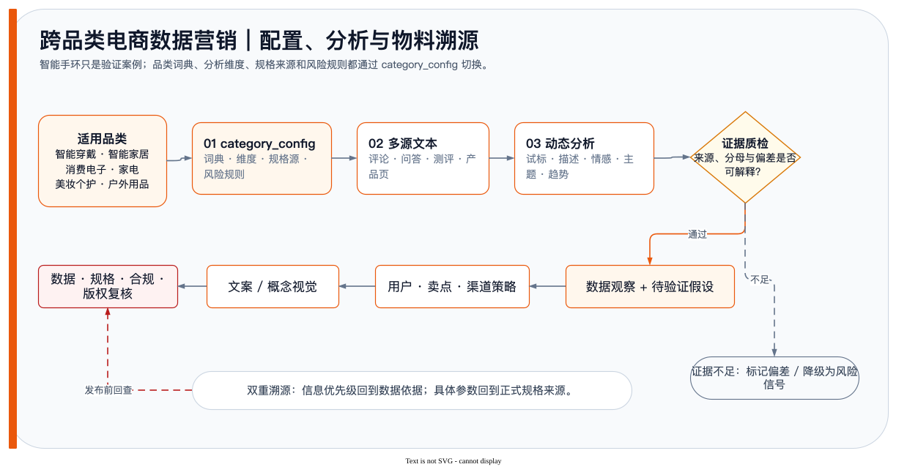

<a id="readme-top"></a>

<p align="center">
  
</p>

# Smart Device Ecommerce Marketing

A cross-category data-marketing workflow with a standard-library configuration validator.

[](https://www.python.org/)
[](LICENSE)
[](https://github.com/ChrysFu/smart-device-ecommerce-marketing/releases)

<div align="right"><a href="#简体中文">简体中文</a> | <a href="#english">English</a></div>

<details>
<summary>目录 / Table of Contents</summary>

- [简体中文](#简体中文)
- [English](#english)

</details>

<a id="简体中文"></a>

## 简体中文

### 项目简介

本仓库记录跨品类商品数据营销的流程、能力契约、Prompt、产品设计与案例分析。`src/category_config.py` 会在分析前检查品类配置是否包含数据来源、分析维度、规格来源、风险规则和所需输出。它不采集数据、不生成营销素材，也不执行自动发布。

### 仓库内容

| 内容 | 文件 |
|---|---|
| 品类配置与六阶段数据营销流程 | [`workflows.md`](workflows.md) |
| 采集、分析、主题与物料 Skill | [`skills.md`](skills.md) |
| 可验证的分析、文案与视觉 Prompt | [`prompt-engineering.md`](prompt-engineering.md) |
| 品类营销设计与智能手环案例 | [`product-design.md`](product-design.md)、[`data-analysis.md`](data-analysis.md) |
| 配置校验参考实现 | [`src/category_config.py`](src/category_config.py) |

### 工作流与案例证据



流程从来源和规格证据开始，经过分析、主题设计、物料规划和人工审核后才允许发布。配置校验器只检查输入结构，不执行这些外部阶段。

<p align="center"></p>

> 图表来自仓库中的智能手环案例分析，只展示文档记录的功能维度提及频次，不是产品规格、性能评分或市场结论。

### 环境与安装

- Python 3.9 或更高版本
- 不需要第三方 Python 包
- Git 仅在克隆仓库时需要

```bash
git clone https://github.com/ChrysFu/smart-device-ecommerce-marketing.git
cd smart-device-ecommerce-marketing
python3 --version
```

项目直接使用 Python 标准库运行，因此不需要执行 `pip install`。

### 使用

运行内置自检：

```bash
python3 src/category_config.py --self-test
```

输出示例配置的校验结果：

```bash
python3 src/category_config.py
```

配置必须包含 `category`、`business_question` 和 `target_channel`，以及非空的 `sources`、`analysis_dimensions`、`spec_source`、`risk_rules` 和 `required_output` 列表。校验成功仍会要求证据闸门和人工发布审核。

### 验证

```bash
python3 -m compileall -q src
python3 src/category_config.py --self-test
```

### 下载与发布

GitHub Release 提供自动生成的源码 ZIP 和 TAR.GZ。仓库没有独立安装程序或自动发布工具；分析、素材生成和正式上线由外部系统及人工审核流程完成。

### 使用边界

- 结论、卖点和视觉素材必须回溯到已核验的数据和规格来源。
- 示例配置不承诺产品能力、健康效果或商业结果。
- 校验器不能替代数据授权、事实核验、合规检查或人工发布批准。

### 许可证

本项目采用 [MIT License](LICENSE)。

<p align="right"><a href="#readme-top">返回顶部</a></p>

<a id="english"></a>

## English

### Overview

This repository documents cross-category product data-marketing workflows, capability contracts, prompts, product design, and case analysis. `src/category_config.py` checks that a category configuration includes data sources, analysis dimensions, specification sources, risk rules, and required outputs before analysis. It does not collect data, generate marketing assets, or publish content automatically.

### Repository contents

| Content | File |
|---|---|
| Category configuration and six-stage data-marketing flow | [`workflows.md`](workflows.md) |
| Collection, analysis, theme, and asset Skills | [`skills.md`](skills.md) |
| Verifiable analysis, copy, and visual prompts | [`prompt-engineering.md`](prompt-engineering.md) |
| Category-marketing design and smart-band case | [`product-design.md`](product-design.md), [`data-analysis.md`](data-analysis.md) |
| Configuration validator | [`src/category_config.py`](src/category_config.py) |

### Workflow and case evidence


The workflow starts from source and specification evidence, then moves through analysis, theme design, asset planning, and human review before release. The configuration validator checks input structure only and does not execute those external stages.

<p align="center"></p>

> The chart comes from the repository's smart-band case analysis. It shows how often documented feature dimensions were mentioned and is not a product specification, performance score, or market conclusion.

### Prerequisites and installation

- Python 3.9 or later
- No third-party Python packages
- Git is only required when cloning the repository

```bash
git clone https://github.com/ChrysFu/smart-device-ecommerce-marketing.git
cd smart-device-ecommerce-marketing
python3 --version
```

The project runs directly on the Python standard library, so no `pip install` step is required.

### Usage

Run the built-in self-test:

```bash
python3 src/category_config.py --self-test
```

Print the validated example configuration:

```bash
python3 src/category_config.py
```

The configuration must include `category`, `business_question`, and `target_channel`, plus non-empty `sources`, `analysis_dimensions`, `spec_source`, `risk_rules`, and `required_output` lists. A successful validation still requires an evidence gate and human release review.

### Validation

```bash
python3 -m compileall -q src
python3 src/category_config.py --self-test
```

### Downloads and releases

GitHub Releases provides automatically generated source ZIP and TAR.GZ archives. The repository has no standalone installer or automated publishing tool; analysis, asset generation, and production release remain responsibilities of external systems and human reviewers.

### Scope and safety

- Conclusions, selling points, and visual material must trace back to verified data and specification sources.
- The example configuration does not promise product capabilities, health effects, or commercial outcomes.
- The validator does not replace data authorization, fact checking, compliance review, or human release approval.

### License

This project is licensed under the [MIT License](LICENSE).

<p align="right"><a href="#readme-top">Back to top</a></p>
