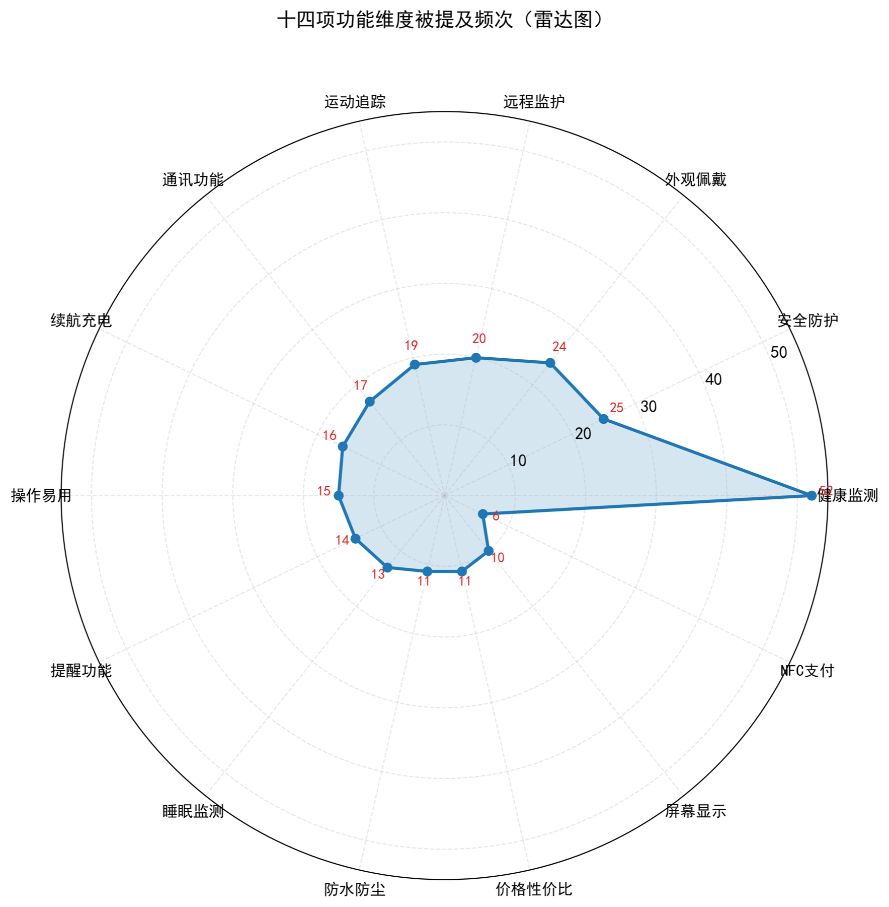
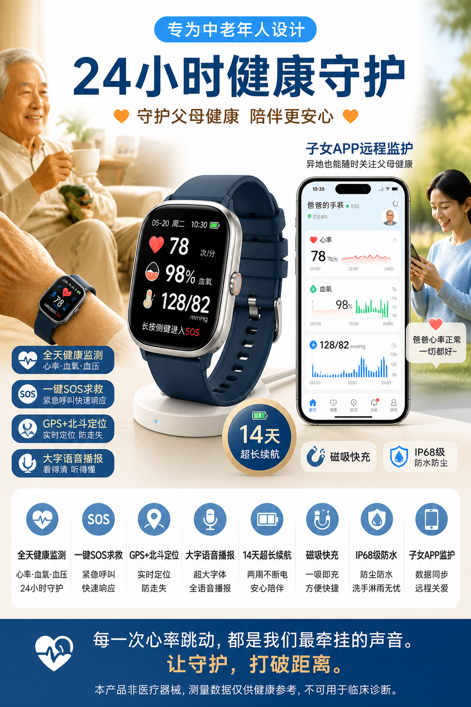
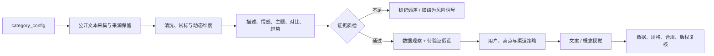

# 智能设备与电商产品数据营销工作流

<div align="center">

<strong>多来源商品文本 → 可回查数据观察 → 待验证营销假设 → 可追溯概念物料</strong>


[跨品类流程](./workflows.md) · [能力契约](./skills.md) · [Prompt 模式](./prompt-engineering.md) · [营销设计](./product-design.md) · [分析模板与案例](./data-analysis.md)

</div>

<table>
  <tr>
    <td width="58%" align="center">
      
    </td>
    <td width="42%" valign="top">
      <h3>🛒 一套方法，按品类配置</h3>
      <p>⌚ 智能穿戴</p>
      <p>🏠 智能家居</p>
      <p>🎧 消费电子</p>
      <p>🧴 美妆个护</p>
      <p>🏕️ 户外与生活方式</p>
      <sub>跨品类营销概念图；图中图标和图表不代表真实商品规格或经营数据。</sub>
    </td>
  </tr>
</table>

> [!NOTE]
> 本仓库是一套**跨品类电商数据营销工作流、Prompt 模式库与案例报告**，不是只服务智能手环的营销工具，也不是可直接运行的插件。智能手环仅用于展示完整实例化过程。

## 简介

商品营销经常在两个环节失真：分析阶段把混合来源文本当成市场总体，生成阶段又把数据观察改写成未经核验的规格或功效。本项目通过 `category_config` 把品类词典、分析维度、正式规格源、风险规则和渠道要求显式配置，再要求每个洞察与物料元素回到数据或规格依据。

适用品类包括但不限于：

`智能穿戴` · `智能家居` · `消费电子` · `家电` · `美妆个护` · `家居日用` · `户外装备` · `宠物用品`

| 输入 | 输出 |
|---|---|
| 品类配置、公开文本、来源标签、正式规格、风险规则、目标渠道 | 描述统计、主题网络、用户/卖点假设、营销架构、元素溯源表、文案或概念视觉 |

## 项目亮点

- 🧰 **品类配置化**：通用的是输入输出契约，不是某个案例的词典与标签。
- 🔗 **来源可回查**：每条文本保留来源类型、URL、时间和版本字段。
- 📐 **动态维度标注**：新品类先试标、校准，再冻结维度和词典版本。
- 🧠 **观察与假设分离**：统计结果不直接等同于购买动机或传播效果。
- 🧾 **数据与规格双溯源**：信息优先级来自数据，具体参数来自正式规格源。
- 🧯 **负面长尾优先检查**：低样本用于风险发现，不用于排名优劣。
- 🎨 **概念物料可审计**：功能元素、可见文字、风险声明和待核对项逐项记录。

## 效果展示

### 案例图表与概念物料

<table>
  <tr>
    <td align="center" width="52%">
      
    </td>
    <td align="center" width="48%">
      
    </td>
  </tr>
  <tr>
    <td><strong>数据图表</strong>：展示案例语料中的功能维度提及频次，仅描述当前样本。</td>
    <td><strong>概念海报</strong>：展示数据到视觉的工作流结果，不对应具体在售商品。</td>
  </tr>
</table>

> [!WARNING]
> 海报中的“14 天”、定位制式、防水等级、健康功能和其他规格文字均为**概念占位**，没有正式规格源时不得作为发布物料使用。

### 通用品类配置

```yaml
category: 扫地机器人
business_question: 哪些问题应进入详情页首屏与负面风险检查
sources: [公开评论, 商品问答, 测评, 产品页]
analysis_dimensions: [清洁力, 避障, 噪音, 维护, 连接, 售后]
spec_source: [正式规格表, 说明书, 检测或授权资料]
risk_rules: [性能条件, 认证表述, 禁止虚构配件与功能]
target_channel: 电商详情页
required_output: [数据观察, 待验证假设, 卖点层级, 元素溯源表]
```

### 跨品类处理链



## 品类配置接口

| 配置项 | 作用 | 智能手环案例 | 其他品类示例 |
|---|---|---|---|
| `category_terms` | 名称、同义词和型号 | 手环、手表、健康监测设备 | 扫地机、洗地机；精华、面霜 |
| `analysis_dimensions` | 统计属性维度 | 健康、安全、佩戴、续航等 14 维 | 清洁力、避障、噪音；肤感、成分、包装 |
| `spec_source` | 具体参数的事实来源 | 正式产品资料与检测依据 | 规格表、说明书、质检报告、授权素材 |
| `risk_rules` | 禁用词、资质与声明要求 | 医疗健康表述与设备资质 | 功效宣称、儿童安全、环保认证 |
| `target_channel` | 内容结构和规格 | 详情页、海报、短视频 | 搜索广告、直播脚本、社媒图文 |

案例中的维度、阈值和风险词不能直接复制到其他品类。

## 功能清单

| 能力 | 交付物 | 文档 |
|---|---|---|
| 多源文本采集适配 | 来源 Schema、失败日志、授权边界 | [skills.md](./skills.md) |
| 动态文本分析 | 品类词典、维度版本、情感与属性统计 | [skills.md](./skills.md) |
| 主题与问题长尾 | 共现网络、主题社区、负面原文簇 | [data-analysis.md](./data-analysis.md) |
| 强制引用式解读 | 数据观察、分母、反面解释、待验证假设 | [prompt-engineering.md](./prompt-engineering.md) |
| 营销产品设计 | 用户关系、三层卖点、六模块营销架构 | [product-design.md](./product-design.md) |
| 溯源式物料 | 数据依据、规格依据、风险项、可见文字清单 | [skills.md](./skills.md) |

## AI 与人工责任

| 环节 | AI 可承担 | 人工必须负责 |
|---|---|---|
| 配置 | 提取候选术语、属性和风险词 | 确定品类边界、定义、规格源和审核人 |
| 采集与分析 | 辅助生成采集、清洗、统计和可视化代码 | 来源授权、抽样策略、口径、运行验收 |
| 洞察 | 提供带数字引用的候选解释 | 回查结果，区分观察、假设与业务判断 |
| 营销方案 | 生成结构化初稿和文案候选 | 卖点优先级、渠道策略和风险红线 |
| 视觉物料 | 生成概念稿和版式候选 | 规格、资质、品牌、版权与发布审批 |

## 技术与方法栈

| 层级 | 工具或方法 |
|---|---|
| 数据契约 | YAML `category_config`、来源 Schema、版本字段 |
| 文本处理案例 | jieba、自定义词典、双层停用词 |
| 情感案例 | SnowNLP（需用新品类人工集重新校准） |
| 主题网络案例 | Counter、词共现、NetworkX、贪心模块度社区 |
| Agent / Prompt | 约束式代码生成、强制引用解读、受控文案、证据先行视觉 |
| 视觉资产 | 数据图表、AI 概念海报、元素溯源表 |
| 文档 | Markdown、YAML、JSON、Mermaid、GitHub Alerts |

> 案例分析数字来自未随仓库发布的 `problem2_analysis.py` 运行结果。本仓库保留方法、参数与报告，不提供可直接执行的分析脚本。

## 安装与使用

### 获取工作流

```bash
git clone https://github.com/ChrysFu-FndVent/smart-device-ecommerce-marketing.git
cd smart-device-ecommerce-marketing
```

README 和方法文档无需安装依赖。若要为新品类实现分析代码，应根据 [prompt-engineering.md](./prompt-engineering.md) 的代码生成契约建立独立 Python 环境、测试和数据版本管理。

### 新品类迁移步骤

1. 在 [skills.md](./skills.md) 中填写并评审 `category_config`。
2. 抽取小样本人工试标，修订维度、词典、停用词和风险规则。
3. 按 [workflows.md](./workflows.md) 采集、清洗并保留来源与失败记录。
4. 参考 [data-analysis.md](./data-analysis.md) 冻结参数、分母和输出版本。
5. 用 [prompt-engineering.md](./prompt-engineering.md) 分离数据观察、反面解释和待验证假设。
6. 按 [product-design.md](./product-design.md) 建立卖点层级与元素溯源表。
7. 发布前完成规格、资质、广告、版权、隐私和可访问性审核。

## 项目结构

```text
smart-device-ecommerce-marketing/
├── README.md
├── workflows.md                 # 品类闸门与六段数据营销流程
├── skills.md                    # 四类能力契约与 category_config
├── prompt-engineering.md        # 四种可验证 Prompt 模式
├── product-design.md            # 用户、卖点与营销模块
├── data-analysis.md             # 通用分析模板与手环案例
└── assets/
    ├── feature-radar.png        # 案例功能维度雷达图
    └── marketing-poster-gpt-image-2.png  # AI 概念海报
```

## 已验证案例：智能手环

| 项目 | 记录 | 使用边界 |
|---|---:|---|
| 样本 | **134 条 / 7 个来源标签 / 20 个品牌** | 公开混合文本，不是随机电商评论 |
| 属性 | **14 维**；健康监测提及率 **38.8%** | 提及率不等于购买重要度 |
| 主题 | **4 个主题社区** | 社区命名需回看原文，不等于传播效果 |
| 情感 | SnowNLP 均值 **0.795** | 只描述当前偏正样本 |
| 视觉 | **9 项**海报元素建立初版溯源表 | 具体规格仍需正式资料核验 |

这些数字证明的是工作流能从一个案例走到可核查物料，不是其他品类的默认基线。

## FAQ

<details>
<summary><strong>这个项目是否只适用于智能手环？</strong></summary>

不是。手环是验证案例。迁移时保留数据 Schema、证据质检和双溯源方法，重新建立品类词典、分析维度、模型阈值、规格源与风险规则。
</details>

<details>
<summary><strong>为什么克隆后找不到分析脚本？</strong></summary>

公开仓库交付方法、参数、Prompt、结果和视觉资产，不发布原案例脚本。README 不提供虚构的运行命令；新品类实现应在独立环境中补齐代码、依赖锁定和测试。
</details>

<details>
<summary><strong>SnowNLP 情感得分可以跨品类直接复用吗？</strong></summary>

不可以。通用模型在医疗健康、美妆、食品或家电术语中可能误判。应建立小规模人工验证集，重新校准词典、阈值和错误模式。
</details>

<details>
<summary><strong>概念海报可以直接发布吗？</strong></summary>

不可以。先逐项核对所有可见文字、规格、功能、资质、人物形象、版权和必要声明。没有正式规格依据的内容必须删除或保留为内部占位。
</details>

<details>
<summary><strong>低样本品牌能否进行排名？</strong></summary>

不能。低样本只用于发现可能的风险主题，应展示样本量并回看原文，不应外推品牌总体口碑或因果关系。
</details>

## 验收与边界

- 每个策略结论附统计依据，或明确标为待验证假设。
- 数字、型号、材质、尺寸、性能、功效均回到正式规格源。
- 来源授权、隐私、版权、广告规范和品类专项要求由人工复核。
- 混合来源样本不作为市场总体，时间推断不作为严格时序结论。
- 新品类必须重新校准情感模型、词典、维度和阈值。

---

<div align="center">

[浏览其他独立 AI 产品项目](https://github.com/ChrysFu-FndVent?tab=repositories)

</div>
