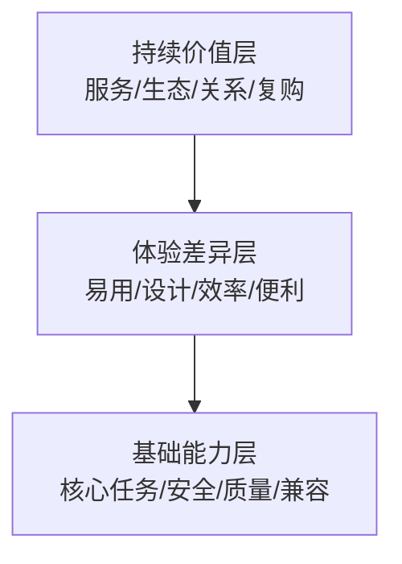

# 产品设计 · 跨品类用户、卖点与营销架构

> 资产类型：营销产品设计文档
> 用途：把营销方案作为可配置产品设计：先识别决策关系，再分层卖点，最后将定位、内容、渠道、节奏和风险组织成可验证模块。

## 一、品类营销画布

| 模块 | 需要回答的问题 | 证据来源 |
|---|---|---|
| 商品边界 | 分析的是哪个品类、子品类、价格带和使用场景 | 商品目录、规格与业务目标 |
| 用户关系 | 购买、付款、使用、影响和维护是否由同一人完成 | 评论线索、访谈、行为数据 |
| 核心任务 | 用户雇佣该商品解决什么问题 | 原文场景、搜索词、售后问题 |
| 卖点层级 | 哪些是入场能力、体验差异和持续价值 | 提及率、负面长尾、正式规格 |
| 竞争参照 | 用户拿什么替代方案做比较 | 对比文本、问答、竞品规格 |
| 风险边界 | 哪些主张需要资质、检测、条件或免责声明 | 法规、平台规则、品类审核 |
| 交付渠道 | 详情页、搜索、直播、短视频或门店分别承担什么任务 | 渠道数据与内容规范 |

## 二、先识别四类常见决策关系

“购买者不等于使用者”只是其中一种结构，不能预设为所有品类都成立。

| 关系模式 | 常见场景 | 设计重点 |
|---|---|---|
| 购买者 = 使用者 | 个护、户外、数码配件 | 需求、规格、价格和体验在同一条沟通线完成 |
| 购买者 ≠ 使用者 | 适老设备、儿童用品、礼赠 | 同时说明购买理由与实际使用门槛 |
| 多人共同使用 | 智能家居、家电、家庭订阅 | 兼顾配置者、日常使用者和维护者 |
| 采购者 ≠ 一线使用者 | 商用设备、团队软件 | 分开表达 ROI、管理能力与操作体验 |

关系模式必须由当前样本和用户研究验证，再决定内容结构。

## 三、三层卖点体系

| 层级 | 定义 | 数据的作用 | 规格的作用 |
|---|---|---|---|
| 基础能力层 | 没有就不会进入候选集的能力 | 识别高频任务和严重负面 | 证明功能、材质、性能确实存在 |
| 体验差异层 | 影响偏好、易用性和价格接受度 | 识别对比点和体验语言 | 确认尺寸、重量、噪音、续航等条件 |
| 持续价值层 | 服务、生态、内容、关系或复购价值 | 提出留存和关系假设 | 说明服务范围、期限、兼容和费用 |

数据用于发现用户关注方向，正式资料用于支持具体商品主张。两者不能互相替代。

## 四、六模块营销架构

| 模块 | 通用交付 | 关键验证 |
|---|---|---|
| ① 定位 | 目标用户、核心任务、参照对象和一句话价值 | 用户是否能正确复述，是否与实际商品一致 |
| ② 卖点分层 | 基础/体验/持续价值的优先级 | 数据依据、规格支持与信息层级测试 |
| ③ 内容矩阵 | 按用户、场景、问题和渠道拆分内容 | 内容消费、点击、收藏、问答或线索指标 |
| ④ 渠道组合 | 搜索、内容、电商、私域或线下的分工 | 各渠道触达对象、成本和转化路径 |
| ⑤ 节奏与实验 | 上新、季节、节庆和日常内容计划 | 明确对照、周期、停止规则和结论边界 |
| ⑥ 风险管控 | 主张清单、规格核验、资质、版权和发布审批 | 禁用词零出现，待核对项全部闭环 |

## 五、已验证案例 · 智能手环

### 5.1 双线用户假设

样本文本同时出现家属远程关注和长辈佩戴体验，形成“购买决策者与使用者可能分离”的假设：

| 用户 | 任务假设 | 内容重点 |
|---|---|---|
| 30–50 岁子女 | 远程了解父母状态、完成关怀型购买 | 趋势信息、异常提醒、配置与服务边界 |
| 60+ 长辈 | 易学、舒适、少充电、紧急时能求助 | 大字交互、佩戴、续航与 SOS 使用流程 |

这是一项待进一步访谈与行为数据验证的关系模型，不表述为已证明的转化比例。

### 5.2 卖点分层实例

| 层级 | 案例数据 | 实例化结果 |
|---|---|---|
| 基础能力 | 健康监测 38.8%、安全防护 18.7% | 优先解释趋势参考、安全提醒及使用边界 |
| 体验差异 | 外观佩戴 17.9%；续航提及 12 次且情感方向为正 | 将舒适、易用和续航作为待测试差异点 |
| 持续价值 | 远程监护 14.9%，相关文本出现家属与数据 | 验证家属同步和健康周报是否有持续价值 |

### 5.3 概念海报元素溯源

| 元素 | 用户数据依据 | 仍需的商品/合规依据 |
|---|---|---|
| 健康守护主信息 | 健康监测 52 次（38.8%） | 功能范围与健康参考声明 |
| 心率/血氧等界面 | “心率 ↔ 监测”共现 16 次 | 实际传感器、算法与展示能力 |
| 家属远程查看 | 远程监护 20 次（14.9%） | APP 功能、账号与隐私机制 |
| SOS 与定位 | 安全防护 25 次（18.7%） | 定位制式、网络条件与服务范围 |
| 大字语音 | 适老体验文本与测评问题 | 实际 UI 和语音功能 |
| 长续航 | 续航词频 12 次且情感方向为正 | 具体测试条件与天数 |
| 防水 | 防水防尘 11 次（8.2%） | 具体等级与检测依据 |
| 非医疗定位 | 低样本文本出现过度承诺风险 | 产品资质和最终免责声明 |

> 海报是课程概念稿，不对应具体在售产品。图中的续航、防水、定位和健康相关文字必须在真实发布前替换为经核验信息。

## 六、迁移示例

| 新品类 | 基础能力候选 | 体验差异候选 | 持续价值候选 | 专项风险 |
|---|---|---|---|---|
| 扫地机器人 | 清洁、避障、覆盖 | 噪音、缠绕、维护 | 地图、耗材、智能家居生态 | 障碍识别和覆盖率条件 |
| 护肤品 | 使用目的、成分与适用肤质 | 肤感、包装、叠加使用 | 复购、搭配与内容服务 | 功效、成分、过敏和广告表述 |
| 户外帐篷 | 容量、结构、防护 | 重量、搭建、收纳 | 配件、维修与场景组合 | 防水、防风和极端环境条件 |
| 宠物智能设备 | 核心监测或喂养任务 | 连接、噪音、清洁 | 多宠、订阅、远程协作 | 宠物安全、断网与误差声明 |

这些是配置示例，不是预设结论。每个品类都需要自己的样本、规格源、人工验证集和风险审核。

## 七、验收规则

1. 用户关系有数据或研究依据，不套用固定画像。
2. 每层卖点至少对应一条用户数据和一条正式规格依据。
3. 六个营销模块都有负责人、输入、输出和验证指标。
4. 概念物料中的功能性元素全部进入溯源表。
5. 新品类上线前完成专项合规、渠道、品牌和版权审核。
