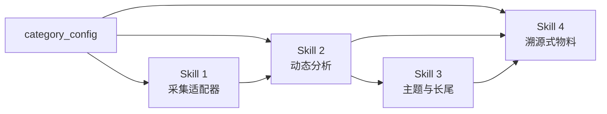

# Skills · 跨品类商品数据营销 4 类能力契约

> 资产类型：能力契约（输入 → 处理 → 输出 → 质量标准）
> 用途：将多来源采集、动态品类分析、主题识别和溯源式营销物料拆成可替换模块。以下是 SOP / 接口定义，不是已安装插件。

## 共享输入 · category_config

```json
{
  "category_id": "目标品类",
  "category_terms": ["品类名", "同义词", "型号规则"],
  "analysis_dimensions": {"维度名": ["关键词", "表达规则"]},
  "product_stopwords": ["高频但低信息量的品类通名"],
  "spec_source": ["已确认规格资料"],
  "risk_rules": {"forbidden": [], "required_disclosures": []},
  "target_channel": "详情页/短视频/社媒/门店"
}
```

配置由品类负责人确认并版本化；智能手环案例中的 14 维词典只是一个实例。

## Skill 1 · 多源商品文本采集适配器

| 段 | 内容 |
|---|---|
| 输入契约 | URL/公开数据列表、来源类型、商品标识、语言/长度限制、采集授权说明 |
| 处理规则 | 按来源路由解析器；剔除页面噪声；按商品范围过滤；内容哈希去重；保留失败日志 |
| 输出契约 | CSV/JSONL：`record_id / product_id / source_type / source_url / content / captured_at` |
| 质量标准 | 每条记录可回查；重复率、空值率和来源占比有报告；失败来源单独记录；不绕过登录与访问控制 |

**案例记录**：7 个公开来源标签清洗后保留 134 条智能手环混合文本，每条均保留回查字段。

## Skill 2 · 动态品类文本分析流水线

| 段 | 内容 |
|---|---|
| 输入契约 | 清洗数据 + `category_config` + 人工试标集 |
| 处理规则 | 文本规范化 → 分词/短语识别 → 通用与品类停用词过滤 → 情感/星级辅助判断 → 动态维度多标签标注 |
| 输出契约 | 原字段 + `tokens / sentiment_score / sentiment_label / dimensions / issues / period` |
| 质量标准 | 专业词切分、维度覆盖、情感方向和多标签冲突均有人工抽检；不同品类分别记录误差 |

**迁移要点**：产品通名表用于剔除“手环”“扫地机”“面霜”等高频但低区分度词；属性词则随品类变化，例如续航/连接、清洁力/噪音、肤感/包装。

## Skill 3 · 主题社区与问题长尾识别

| 段 | 内容 |
|---|---|
| 输入契约 | 每条文本的 tokens、维度标签、商品和来源标识 |
| 处理规则 | 高频词/短语筛选 → 单文本共现 → 最低边权过滤 → 网络布局与社区检测 → 负面原文聚类 |
| 输出契约 | 共现矩阵、网络图、社区清单、负面问题清单及示例原文索引 |
| 质量标准 | 固定随机种子和参数；做参数敏感性检查；社区命名与问题归因必须回看原文 |

**案例记录**：智能手环数据识别 4 个主题社区；最强共现词对“心率 ↔ 监测”出现 16 次。该结果仅属于案例数据。

## Skill 4 · 数据与规格双溯源物料设计

| 段 | 内容 |
|---|---|
| 输入契约 | 洞察清单、正式规格源、风险规则、品牌规范、物料类型与渠道要求 |
| 处理规则 | 建立“主张 ↔ 用户数据 ↔ 产品规格 ↔ 合规依据”映射；排序信息层级；生成概念稿；输出待核对项 |
| 输出契约 | 文案或视觉稿 + 元素溯源表 + 规格/资质待核对清单 + 版本记录 |
| 质量标准 | 每个功能与参数主张覆盖溯源；禁用词零出现；必备声明齐全；品牌、版权、可访问性和渠道规格经人工确认 |

**案例记录**：智能手环概念海报的 9 项元素建立了初版溯源表；“14 天”、定位制式和资质标注均被列为发布前待核验项。

## 组合关系



上游输出即下游输入。替换品类、情感模型或可视化方法时，只要保持契约和验证集不变，其他模块无需同步重写。
