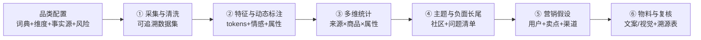
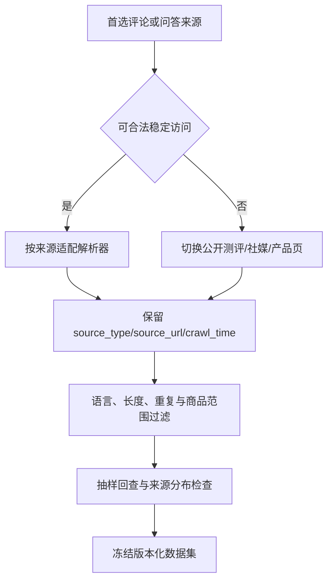

# Workflows · 跨品类电商数据营销六段流程

> 资产类型：端到端工作流
> 用途：把“多来源商品文本 → 可核查营销方案”拆成品类配置和六个可交付阶段，并明确 AI、人工和事实源的边界。

## 一、运行前闸门：品类配置

流程不内置某一商品的固定词典。开始采集前先锁定：

| 配置 | 必填内容 | 出口检查 |
|---|---|---|
| 商品范围 | 品类、子品类、型号/系列、地区与时间范围 | 不混入用途和价格带明显不同的商品 |
| 数据来源 | 评论、问答、测评、社媒、产品页及其授权边界 | 每条数据保留来源类型和 URL |
| 分析维度 | 功能、体验、价格、服务、场景等动态维度 | 维度互斥性与覆盖度经过小样本试标 |
| 事实源 | 规格表、说明书、检测或授权资料 | 具体参数只有一个可追溯的权威落点 |
| 风险规则 | 品类禁用词、资质、免责声明和审核角色 | 高风险主张默认不由模型补全 |
| 交付目标 | 详情页、广告、短视频、社媒或门店物料 | 尺寸、受众、渠道规则和 CTA 明确 |

## 二、全流程框架

这与[文生应用 Agent 的「意图 → 澄清 → 计划 → 执行 → 验证 → 交付」框架](https://github.com/ChrysFu-FndVent/text-to-app-agent/blob/main/workflows.md)采用同一种任务抽象：在高成本执行前完成配置和确认。

## 三、阶段任务与责任

| 阶段 | 核心产出 | AI 可承担 | 人工必须负责 |
|---|---|---|---|
| ① 采集清洗 | 带来源、时间和商品标识的文本数据集 | 辅助生成解析器、去重与格式化代码 | 授权判断、抽样策略、来源平衡、运行验收 |
| ② 特征标注 | 分词、情感、属性、场景和问题标签 | 流水线代码与候选词扩展 | 品类词典、维度定义、人工抽检与阈值校准 |
| ③ 多维统计 | 来源/商品/维度/时间的交叉统计 | 统计和可视化代码 | 分母口径、缺失值规则、最低样本门槛 |
| ④ 主题与长尾 | 主题社区、共现关系、负面问题清单 | 建模与候选命名 | 参数选择、社区解释、原文回查 |
| ⑤ 营销假设 | 用户关系、卖点层级、内容与渠道假设 | 基于数字生成候选解释 | 商业合理性、优先级、验证计划 |
| ⑥ 物料与复核 | 文案/视觉概念稿、元素溯源表、待核对项 | 结构化初稿与概念生成 | 规格、资质、品牌、版权、渠道和发布审批 |

## 四、关键工作流

### 4.1 多源采集与降级

采集策略变化必须记录原因及对样本代表性的影响。智能手环案例因目标评论接口需要登录，改用 7 个公开来源标签，清洗后得到 134 条可回查文本；该数量不是通用最低样本要求。

### 4.2 动态维度构建

1. 从业务目标和商品规格建立第一版维度，不直接让模型自由聚类后命名；
2. 抽取一小批文本做人工试标，记录“无法归类”“一条多类”和容易混淆的维度；
3. 调整词典、正则和多标签规则后再运行全量；
4. 新品类必须重新建立验证集，不沿用上一品类的准确率与阈值。

智能设备通常关注功能、连接、稳定性、续航、生态和售后；普通电商商品可改为材质/成分、尺寸、使用场景、体验、包装、价格与服务。维度数量由任务决定，不固定为 14。

### 4.3 洞察质检闸门

1. AI 只能基于已冻结的统计结果生成候选，每条引用原始数字和口径；
2. 人工回查统计文件和原始文本，确认数字存在且解释没有越过证据；
3. 观察写成“本样本中……”，推断写成“假设（待验证）……”；
4. 只有“数据可回查 + 商品逻辑成立 + 无规格冲突”三项通过，才进入营销方案。

案例中，AI 曾将“续航提及 12 次”改写为“用户最关注续航”，但它在 14 维中仅排第 7（11.9%）。最终只保留“本样本提及率不高、情感方向为正，可作为次级卖点测试”。

## 五、跨品类迁移规则

1. **流程固定，配置可变**：保留六段接口，替换品类词典、维度、事实源和风险规则。
2. **先定义交付再选工具**：每阶段输出必须能被下一阶段直接消费和验收。
3. **规格事实与用户关注分离**：评论说明用户谈论什么，正式资料证明商品实际能做什么。
4. **负面长尾单独处理**：低频但高风险的问题进入产品与话术检查，不被平均情感掩盖。
5. **每个新品类重建基线**：样本结构、情感模型、最低样本门槛和实验指标均需重新验证。
